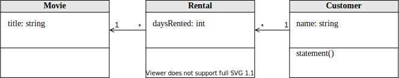
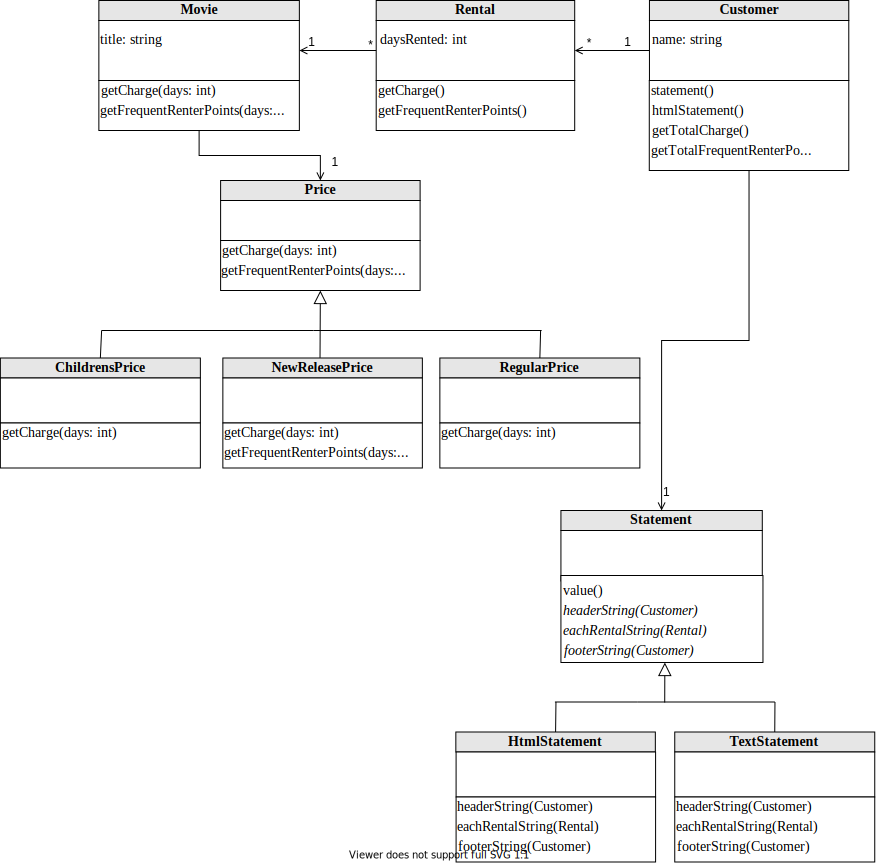

# Understanding Refactoring Tasks over Time: A Study Using Refactoring Graphs

The
refactoring operations performed by the students (and our analysis) are publicly
available at: [xx]().

## Class Diagram

Initial class diagram of the  Video Store System:

Final version after applying the refactorings:

