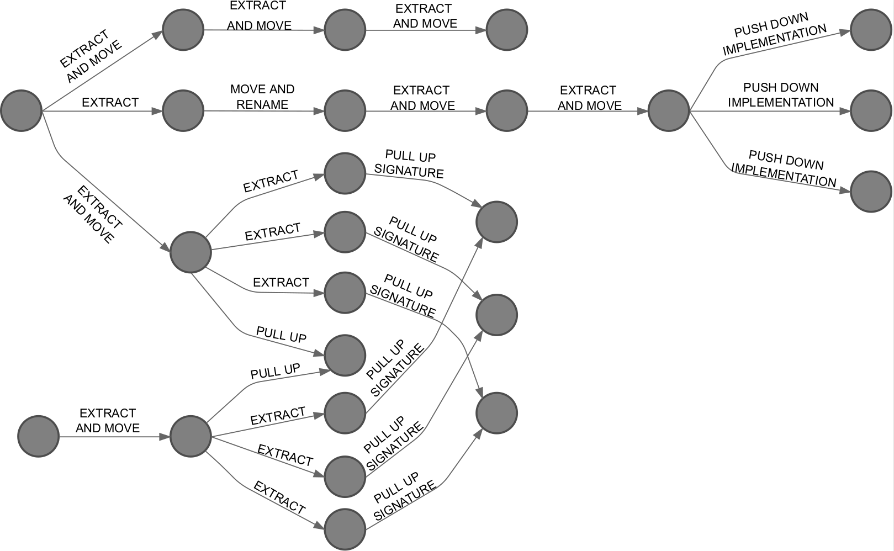

# Summary

Repository of the paper "Understanding Refactoring Tasks over Time: A Study Using Refactoring Graphs" accepted at XXV Ibero-American Conference on Software Engineering (CIbSE), 2022.

The study is described in details in the following paper:

> Aline Brito, Andre Hora, and Marco Tulio Valente. [Understanding Refactoring Tasks over Time:
A Study Using Refactoring Graphs](https://alinebrito.com/papers/cibse2022_refactoring_graphs.pdf). XXV Ibero-American Conference on Software Engineering ([CIbSE](https://cibse2022.frc.utn.edu.ar)), 2022.

```
@inproceedings{Brito:CIbSE:2022:RefGraphs,
    author = {Aline Brito and Andre Hora and Marco Tulio Valente},
    title = {Understanding Refactoring Tasks over Time: A Study Using Refactoring Graphs},
    year = {2022},
    booktitle = {XXV Ibero-American Conference on Software Engineering (CIbSE)},
    pages = {1-15}
}
```

Webpage and dataset: [alinebrito.github.io/refgraph-fowler-study](https://alinebrito.github.io/refgraph-fowler-study)


## Class Diagram

Initial class diagram of the  Video Store System:


Final version after applying the refactorings:


## Refactoring subgraph from Video Store System (ground-truth)


